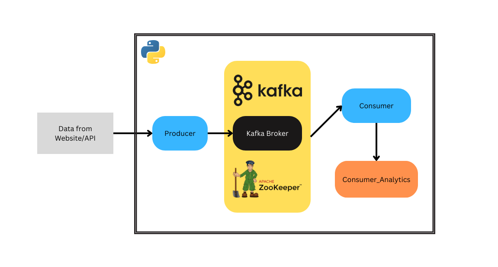

# Food Ordering App Backend with Apache Kafka

## Overview
This project presents a scalable backend system for a food ordering app, leveraging the power of Apache Kafka as a central event bus. Events, such as order placements and confirmations, are written to Kafka topics, facilitating real-time processing by different components like microservices, stream processing jobs, and Python modules.

## Features
- **Event-Driven Architecture:** Key actions in the system are represented as events, providing a flexible and responsive architecture.
- **Decoupled Components:** Individual system components, be it microservices, stream processors, or standalone Python files, can be scaled independently.
- **Scalability:** The decoupled nature allows seamless scaling of specific components based on demand.
- **Extensibility:** Apache Kafka's message retention enables building new components that can process historical events by replaying messages from the beginning.
- **Fault Tolerance:** Kafka's persistence ensures data integrity, preventing data loss in case of issues with upstream or downstream systems.

## Technologies Used
- **Apache Kafka:** Central event bus for efficient communication between system components.
- **kafka-python:** Library used to connect the Python code with the locally running Kafka broker.

## Getting Started
1. Clone the repository: `git clone https://github.com/Yukesh0409/Food-order-streaming-using-kafka`
2. Install dependencies: `pip install -r requirements.txt`
3. Configure Kafka connection in `docker-compose.yml`.
4. Run the application

## Usage
- Explore the `Py files` directory for different components and their functionalities.
- Customize Kafka topics, event structures, and processing logic as per your application requirements.

Feel free to contribute, report issues, or suggest improvements!
